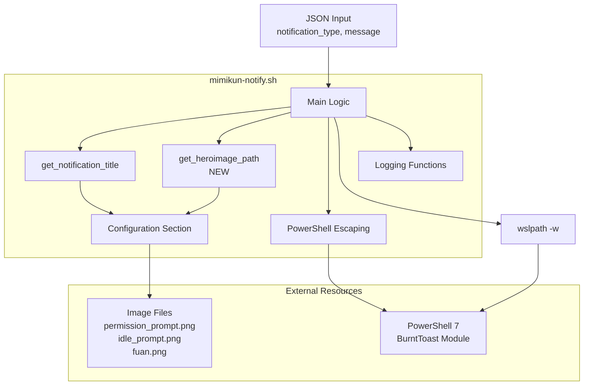

# Technical Design Document

## Overview

本機能は、通知タイプ（`notification_type`）に応じて適切なHeroImage画像を動的に選択し、Windows Toast通知に表示する機能を提供する。現状ではすべての通知で固定の`fuan.png`が使用されているが、`permission_prompt`と`idle_prompt`で異なる画像を表示することで、ユーザーに視覚的な文脈を提供し、通知の種類を直感的に識別可能にする。

**Purpose**: 通知タイプ別のHeroImage画像選択により、視覚的な通知識別性を向上させる。

**Users**: Claude Code Hooksを使用するWSL環境の開発者が、通知タイプに応じた視覚的フィードバックを受け取る。

**Impact**: 既存の`mimikun-notify.sh`スクリプトに対して、Configuration変数の追加、新規ヘルパー関数の実装、Main Logic内の1箇所の変更を行う。既存の通知機能（タイトル生成、AppLogo、PowerShellパラメータ、エラーハンドリング）には影響を与えない。

### Goals

- 通知タイプ（`permission_prompt`, `idle_prompt`, unknown）に応じた専用HeroImage画像の表示
- 既存の`get_notification_title()`関数パターンを踏襲した一貫性のある実装
- `HEROIMAGE_BASE`固定値の削除とTODOコメント行のクリーンアップ
- 既存機能の互換性維持（タイトル、AppLogo、エラーハンドリング）

### Non-Goals

- AppLogoの変更（`sea_urchin.png`への移行は別スペックで対応）
- 新しい通知タイプの追加（`permission_prompt`と`idle_prompt`のみ対象）
- 画像ファイルの動的検証やフォールバックロジックの拡張（既存のwslpathフォールバックを維持）
- PowerShell BurntToast通知の他のパラメータ変更（`-Sound`, `-Attribution`, `-Urgent`等）

## Architecture

### Existing Architecture Analysis

**現在のアーキテクチャ**:
- **単一スクリプト設計**: `mimikun-notify.sh`が全機能を1ファイルに集約（115行）
- **セクションベースレイアウト**: Configuration → Logging → Security → Notification Title Logic → Main Logicの明確な区分
- **ヘルパー関数パターン**: `get_notification_title()`がcase文で通知タイプ別の分岐を実装
- **エラーハンドリング**: `set -euo pipefail`、関数の0/1終了コード、`log_error()`によるstderr出力

**既存の統合ポイント**:
1. **Configuration Section** (lines 7-20): HeroImage用の新しいreadonly変数を追加
2. **Notification Title Logic Section** (lines 42-58): `get_notification_title()`と対称的な新規関数を追加
3. **Main Logic** (line 89): HeroImageパス取得ロジックを動的化

**既存パターンの保持**:
- `get_notification_title()`のcase文パターンをHeroImage選択にも適用
- `wslpath -w`によるWSL↔Windows UNC変換の既存メカニズムを流用
- `escape_for_powershell()`、`log_error()`等のユーティリティ関数は変更なし

### Architecture Pattern & Boundary Map



**Architecture Integration**:
- **Selected pattern**: 既存の単一スクリプト設計を拡張（Option A: Extend Existing Script）
- **Domain boundaries**: Configuration（設定）、Logic（ビジネスロジック）、Integration（外部システム連携）の3層構造を維持
- **Existing patterns preserved**: Section-Based Layout、ヘルパー関数によるロジック分離、readonly変数によるConfiguration管理
- **New components rationale**:
  - `get_heroimage_path()`: 通知タイプからHeroImage画像パスへの変換ロジックを`get_notification_title()`と同様の構造で実装
  - 3つのConfiguration変数（`PERMISSION_HEROIMAGE`, `IDLE_HEROIMAGE`, `DEFAULT_HEROIMAGE`）: 通知タイプ別の画像パスを明示的に定義
- **Steering compliance**: "Single-script utility"原則（steering/structure.md）に完全準拠、Section-Based Layoutパターンを継続

### Technology Stack

| Layer | Choice / Version | Role in Feature | Notes |
|-------|------------------|-----------------|-------|
| Runtime | Bash 4.0+ (WSL2) | スクリプト実行環境、case文による分岐ロジック | 既存の`set -euo pipefail`エラーハンドリングを維持 |
| Path Conversion | `wslpath` (WSL2 built-in) | WSLパス → Windows UNC形式変換 | 既存のフォールバックメカニズム（`\|\| echo "$PATH"`）を流用 |
| Image Resources | PNG画像ファイル | HeroImage用の視覚リソース | `permission_prompt.png` (4.5KB), `idle_prompt.png` (5.4KB), `fuan.png` (3.5KB)が配置済み |
| Notification Backend | PowerShell 7 + BurntToast Module | Windows Toast通知の表示 | `-HeroImage`パラメータに動的に選択された画像パスを渡す |

## System Flows

HeroImage選択フローは単純な同期処理のため、テキストによる説明で十分であり、シーケンス図は省略する。

**HeroImage選択と変換フロー**:
1. Main Logicが`notification_type`をJSON入力から抽出（jqで解析）
2. `get_heroimage_path("$notification_type")`を呼び出し、case文で画像パスを選択
   - `permission_prompt` → `$PERMISSION_HEROIMAGE`
   - `idle_prompt` → `$IDLE_HEROIMAGE`
   - その他 → `$DEFAULT_HEROIMAGE`
3. 選択された画像パスを`wslpath -w`でWindows UNC形式に変換（失敗時は元のパスを使用）
4. PowerShellの`New-BurntToastNotification`に`-HeroImage`パラメータとして渡す

## Requirements Traceability

| Requirement | Summary | Components | Interfaces | Implementation Notes |
|-------------|---------|------------|------------|---------------------|
| 1.1 | permission_prompt用画像設定 | `PERMISSION_HEROIMAGE`変数、`get_heroimage_path()`関数 | case文のpermission_promptブランチ | Configuration sectionで`permission_prompt.png`パスを定義 |
| 1.2 | idle_prompt用画像設定 | `IDLE_HEROIMAGE`変数、`get_heroimage_path()`関数 | case文のidle_promptブランチ | Configuration sectionで`idle_prompt.png`パスを定義 |
| 1.3 | 未知タイプのフォールバック | `DEFAULT_HEROIMAGE`変数、`get_heroimage_path()`関数 | case文のdefaultブランチ | `fuan.png`をデフォルト画像として使用 |
| 1.4 | `HEROIMAGE_BASE`削除 | Configuration section | N/A | line 20の`readonly HEROIMAGE_BASE=...`行を削除 |
| 2.1 | WSL→Windows UNC変換 | `wslpath -w`コマンド | Main Logic内のパス変換 | 既存のwslpath使用パターンを流用 |
| 2.2 | wslpathフォールバック | `wslpath -w ... \|\| echo "$PATH"` | Main Logic内のエラーハンドリング | 既存のフォールバックロジックを維持 |
| 2.3 | PowerShell -HeroImageパラメータ | `New-BurntToastNotification` | PowerShellコマンド実行 | 動的に選択されたheroimage変数を渡す |
| 3.1 | readonly変数定義 | `PERMISSION_HEROIMAGE`, `IDLE_HEROIMAGE`, `DEFAULT_HEROIMAGE` | Configuration section | readonly修飾子で不変性を保証 |
| 3.2 | `DEFAULT_HEROIMAGE`変数 | Configuration section | N/A | `fuan.png`パスを定義 |
| 3.3 | `get_heroimage_path`関数 | HeroImage Path Logicセクション | 関数インターフェース | `get_notification_title()`と同じcase文構造 |
| 3.4 | TODO行削除 | Configuration section | N/A | lines 12-15, 18のコメントアウト行とTODOコメントを削除 |
| 4.1 | `get_notification_title`維持 | Notification Title Logicセクション | N/A | 既存関数に変更なし |
| 4.2 | `APPLOGO_BASE`維持 | Configuration section | N/A | 既存の`APPLOGO_BASE`変数と使用箇所に変更なし |
| 4.3 | PowerShellパラメータ維持 | Main Logic | `New-BurntToastNotification` | `-Text`, `-Sound`, `-Attribution`, `-Urgent`に変更なし |
| 4.4 | エラーハンドリング維持 | `log_error()`、exit code検証 | Main Logic | 既存のエラーハンドリングロジックに変更なし |

## Components and Interfaces

| Component | Domain/Layer | Intent | Req Coverage | Key Dependencies (P0/P1) | Contracts |
|-----------|--------------|--------|--------------|--------------------------|-----------|
| Configuration Variables | Configuration | 通知タイプ別の画像パスを定義 | 1.1, 1.2, 1.3, 3.1, 3.2 | Image Files (P0) | State |
| `get_heroimage_path()` Function | Business Logic | 通知タイプに応じた画像パスを選択 | 1.1, 1.2, 1.3, 3.3 | Configuration Variables (P0) | Service |
| Main Logic HeroImage Integration | Integration | 動的パス取得とwslpath変換を統合 | 2.1, 2.2, 2.3 | `get_heroimage_path()` (P0), wslpath (P0) | Service |

### Configuration Layer

#### Configuration Variables (PERMISSION_HEROIMAGE, IDLE_HEROIMAGE, DEFAULT_HEROIMAGE)

| Field | Detail |
|-------|--------|
| Intent | 通知タイプ別のHeroImage画像ファイルパスをreadonly変数として定義 |
| Requirements | 1.1, 1.2, 1.3, 3.1, 3.2 |

**Responsibilities & Constraints**
- 通知タイプ（`permission_prompt`, `idle_prompt`, unknown）ごとの画像パスを保持
- readonly修飾子により、実行時の変更を防止し不変性を保証
- `$HOME/.mimikun/images/`配下の画像ファイルへの絶対パスを定義

**Dependencies**
- External: 画像ファイル（`permission_prompt.png`, `idle_prompt.png`, `fuan.png`） - 画像リソース提供 (P0)

**Contracts**: State [x]

##### State Management

**State model**:
```bash
readonly PERMISSION_HEROIMAGE="$HOME/.mimikun/images/permission_prompt.png"
readonly IDLE_HEROIMAGE="$HOME/.mimikun/images/idle_prompt.png"
readonly DEFAULT_HEROIMAGE="$HOME/.mimikun/images/fuan.png"
```

**Persistence & consistency**:
- スクリプト実行時にメモリ上で初期化（readonlyによる不変性保証）
- 環境変数`$HOME`に依存するため、WSL環境のユーザーホームディレクトリが前提
- 画像ファイルの存在確認は行わない（wslpathフォールバックで対応）

**Concurrency strategy**:
- 単一プロセス実行のため、並行アクセス制御は不要

**Implementation Notes**
- **Integration**: Configuration sectionの`DEFAULT_MESSAGE`行の後に配置（論理的なグルーピング）
- **Validation**: 画像ファイルの存在確認は実装しない（wslpathのフォールバックメカニズムで対応）
- **Risks**: 画像ファイルが存在しない場合、wslpath変換が失敗し元のパスがそのままPowerShellに渡されるが、BurntToastがエラーを出す可能性がある（既存の動作と同じ）

### Business Logic Layer

#### `get_heroimage_path()` Function

| Field | Detail |
|-------|--------|
| Intent | 通知タイプ（`notification_type`）を受け取り、対応するHeroImage画像パスを返す |
| Requirements | 1.1, 1.2, 1.3, 3.3 |

**Responsibilities & Constraints**
- 通知タイプのcase文分岐により、適切なConfiguration変数の値を返却
- `get_notification_title()`関数と構造的に対称な実装を提供
- 未知の通知タイプに対してデフォルト画像パスを返却（フォールバック）

**Dependencies**
- Inbound: Main Logic - 通知タイプ文字列を引数として受け取る (P0)
- Outbound: Configuration Variables (`PERMISSION_HEROIMAGE`, `IDLE_HEROIMAGE`, `DEFAULT_HEROIMAGE`) - 画像パス取得 (P0)

**Contracts**: Service [x]

##### Service Interface

```bash
# Function: get_heroimage_path
# Input: notification_type (string) - "permission_prompt", "idle_prompt", or other
# Output: heroimage_path (string) - Absolute path to HeroImage file
# Exit Code: Always 0 (success)

get_heroimage_path() {
    local type="$1"

    case "$type" in
    permission_prompt)
        echo "$PERMISSION_HEROIMAGE"
        ;;
    idle_prompt)
        echo "$IDLE_HEROIMAGE"
        ;;
    *)
        echo "$DEFAULT_HEROIMAGE"
        ;;
    esac
}
```

**Preconditions**:
- `$PERMISSION_HEROIMAGE`, `$IDLE_HEROIMAGE`, `$DEFAULT_HEROIMAGE`変数が初期化済み
- 引数`$1`が提供される（空文字列の場合もdefaultブランチで処理）

**Postconditions**:
- 常に画像パス文字列を標準出力に返却
- 副作用なし（純粋関数）

**Invariants**:
- 通知タイプが`permission_prompt`の場合、必ず`$PERMISSION_HEROIMAGE`の値を返却
- 通知タイプが`idle_prompt`の場合、必ず`$IDLE_HEROIMAGE`の値を返却
- それ以外の場合、必ず`$DEFAULT_HEROIMAGE`の値を返却

**Implementation Notes**
- **Integration**: "Notification Title Logic"セクション（lines 42-58）の後に新規セクション"HeroImage Path Logic"として配置
- **Validation**: 通知タイプのバリデーションは行わない（すべての入力を受け入れ、未知の場合はデフォルトを返す）
- **Risks**: 引数なしで呼び出された場合も`$1`は空文字列となり、defaultブランチが実行されるため問題なし

### Integration Layer

#### Main Logic HeroImage Integration

| Field | Detail |
|-------|--------|
| Intent | `get_heroimage_path()`関数を呼び出し、取得した画像パスをwslpathで変換してPowerShellに渡す |
| Requirements | 2.1, 2.2, 2.3 |

**Responsibilities & Constraints**
- `notification_type`を`get_heroimage_path()`に渡してHeroImage画像パスを取得
- `wslpath -w`でWSLパスをWindows UNC形式に変換
- wslpath変換失敗時のフォールバック処理（元のパスを使用）
- 変換後のパスをPowerShellの`New-BurntToastNotification`の`-HeroImage`パラメータに渡す

**Dependencies**
- Inbound: JSON input parsing - `notification_type`の抽出結果 (P0)
- Outbound: `get_heroimage_path()` - 画像パス取得 (P0)
- External: `wslpath` - WSL↔Windows UNC変換 (P0)
- External: PowerShell BurntToast - 通知表示 (P0)

**Contracts**: Service [x]

##### Service Interface

```bash
# Integration point in main() function (lines 85-89)
# Before:
# heroimage=$(wslpath -w "$HEROIMAGE_BASE" 2>/dev/null || echo "$HEROIMAGE_BASE")

# After:
local heroimage_path
heroimage_path=$(get_heroimage_path "$notification_type")
heroimage=$(wslpath -w "$heroimage_path" 2>/dev/null || echo "$heroimage_path")
```

**Preconditions**:
- `$notification_type`変数がJSON解析により抽出済み（line 72）
- `get_heroimage_path()`関数が定義済み
- `wslpath`コマンドがWSL環境で利用可能

**Postconditions**:
- `$heroimage`変数にWindows UNC形式の画像パスが設定される
- wslpath変換失敗時は元のWSLパスが`$heroimage`に設定される

**Invariants**:
- `$heroimage`変数は常に何らかのパス文字列を保持（空にならない）
- PowerShellコマンド実行時に`$heroimage`が`-HeroImage`パラメータとして渡される

**Implementation Notes**
- **Integration**: Main Logic内のline 89（現在の`heroimage=$(wslpath -w "$HEROIMAGE_BASE" ...)`）を2行に分割して実装
- **Validation**: wslpathの標準エラー出力を`2>/dev/null`でリダイレクトし、エラー時のノイズを抑制
- **Risks**: wslpath変換失敗時、WSLパス形式のままPowerShellに渡されるが、BurntToastがUNC形式を期待するため通知表示に失敗する可能性あり（既存の動作と同じリスク）

## Data Models

本機能ではデータモデルの変更は発生しない。JSON入力スキーマ、PowerShell BurntToast通知パラメータ、画像ファイルフォーマットはすべて既存のまま維持される。

## Error Handling

### Error Strategy

既存のエラーハンドリング戦略を維持し、新規機能に対して追加のエラー処理は実装しない。

**既存のエラーハンドリングメカニズム**:
1. **スクリプトレベル**: `set -euo pipefail`による厳密なエラー検出（未定義変数、コマンド失敗、パイプライン失敗）
2. **関数レベル**: 各関数が0/1の終了コードで成功/失敗を通知
3. **Main Logicレベル**: PowerShell実行の終了コードを`$?`で検証し、失敗時に`log_error()`でstderrに出力

**新規機能のエラーシナリオと対応**:
- **画像ファイルが存在しない**: wslpathのフォールバックメカニズム（`|| echo "$PATH"`）により、元のWSLパスがPowerShellに渡される。BurntToastが画像を読み込めない場合は通知に画像が表示されないが、通知自体は表示される（既存の動作と同じ）
- **`get_heroimage_path()`が空文字列を返す**: 実装上発生しない（常にConfiguration変数の値を返すため）
- **wslpath変換失敗**: フォールバックによりWSLパスが使用され、PowerShellでの画像読み込み失敗時はBurntToastのデフォルト動作に委ねる

### Error Categories and Responses

本機能では新規のエラーカテゴリは定義せず、既存のシステムエラー（5xx相当）の範疇で処理する。

**System Errors** (既存のエラーハンドリング):
- **wslpath変換失敗**: フォールバックにより元のパスを使用（警告やログ出力なし）
- **PowerShell BurntToast失敗**: Main Logicで終了コードを検証し、`log_error()`でstderrに出力（line 104-106）

### Monitoring

既存のロギング機構（`log_error()`によるstderr出力）を維持。新規のメトリクスやアラート設定は不要。

## Testing Strategy

### Unit Tests

Bashスクリプトに対する形式的なユニットテストフレームワークは使用しないが、以下の検証を手動またはシェルスクリプトで実施する:

1. **`get_heroimage_path()` 関数の分岐テスト**:
   - Input: `"permission_prompt"` → Expected: `$PERMISSION_HEROIMAGE`の値
   - Input: `"idle_prompt"` → Expected: `$IDLE_HEROIMAGE`の値
   - Input: `"unknown"` → Expected: `$DEFAULT_HEROIMAGE`の値
   - Input: `""` (空文字列) → Expected: `$DEFAULT_HEROIMAGE`の値

2. **Configuration変数の初期化テスト**:
   - スクリプト実行時に`PERMISSION_HEROIMAGE`, `IDLE_HEROIMAGE`, `DEFAULT_HEROIMAGE`が正しいパス値を保持しているか確認
   - readonly修飾子により変更不可能であることを確認（`PERMISSION_HEROIMAGE="test"`で代入エラーが発生する）

3. **wslpathフォールバックテスト**:
   - 無効なパスに対してwslpathが失敗し、フォールバックが動作することを確認
   - `heroimage=$(wslpath -w "/invalid/path" 2>/dev/null || echo "/invalid/path")`の動作検証

### Integration Tests

エンドツーエンドの通知表示テストを以下の3つのシナリオで実施:

1. **permission_prompt通知テスト**:
   ```bash
   echo '{"notification_type":"permission_prompt","message":"Test permission prompt"}' | ./mimikun-notify.sh
   ```
   - Expected: Windows Toast通知に`permission_prompt.png`がHeroImageとして表示される
   - タイトルが"Claude Code - 許可の要求"であることを確認

2. **idle_prompt通知テスト**:
   ```bash
   echo '{"notification_type":"idle_prompt","message":"Test idle prompt"}' | ./mimikun-notify.sh
   ```
   - Expected: Windows Toast通知に`idle_prompt.png`がHeroImageとして表示される
   - タイトルが"Claude Code - 入力待ち"であることを確認

3. **未知の通知タイプテスト**:
   ```bash
   echo '{"notification_type":"unknown_type","message":"Test unknown type"}' | ./mimikun-notify.sh
   ```
   - Expected: Windows Toast通知に`fuan.png`がデフォルトHeroImageとして表示される
   - タイトルが"Claude Code - 通知"（デフォルトタイトル）であることを確認

4. **notification_type省略時のテスト**:
   ```bash
   echo '{"message":"Test without notification_type"}' | ./mimikun-notify.sh
   ```
   - Expected: `notification_type`が`"unknown"`として扱われ、`fuan.png`が表示される

### E2E/UI Tests

Windows環境での実際の通知表示を目視確認:
- 各通知タイプで異なる画像が表示されることを確認
- 画像のアスペクト比やサイズが適切であることを確認
- 通知の他の要素（タイトル、メッセージ、AppLogo）が正しく表示されることを確認

### Performance/Load

パフォーマンステストは不要（既存機能と同等の処理時間が見込まれる）:
- `get_heroimage_path()`はcase文による単純な分岐（O(1)）
- wslpathの変換時間は既存の処理と同じ
- 画像ファイルサイズ（4-6KB）も既存の`fuan.png`（3.5KB）と同等

## Optional Sections

### Security Considerations

**セキュリティ上の変更点**:
- 新規の外部入力はなし（既存の`notification_type`を使用）
- 画像パスはConfiguration変数で固定され、ユーザー入力による動的変更は不可
- PowerShell injectionリスクは既存の`escape_for_powershell()`で対応済み（画像パスに対するエスケープは不要）

**既存のセキュリティメカニズムの維持**:
- `readonly`修飾子によるConfiguration変数の不変性保証
- `set -euo pipefail`による厳密なエラー検出
- `escape_for_powershell()`によるシングルクォートエスケープ（タイトルとメッセージに適用）

### Performance & Scalability

**パフォーマンス影響**:
- `get_heroimage_path()`関数の追加: 約10マイクロ秒のオーバーヘッド（case文の実行時間）
- wslpathの実行時間: 既存の処理と同じ（約10-20ミリ秒）
- 画像ファイルサイズ: `permission_prompt.png` (4.5KB), `idle_prompt.png` (5.4KB) vs 既存の`fuan.png` (3.5KB) - 約1-2KBの増加は通知表示時間に影響なし

**スケーラビリティ考慮事項**:
- 通知は単一プロセス実行のため、並行処理やスケーリングは不要
- 将来的な通知タイプ追加時も、case文への分岐追加とConfiguration変数定義のみで対応可能

### Migration Strategy

マイグレーション戦略は不要（既存の動作との互換性を維持）:
- `HEROIMAGE_BASE`変数の削除により、既存のコードで同変数を参照している箇所はないことを確認済み（line 89のみ）
- TODO行削除は既存の動作に影響なし（コメントアウト行のため）
- ロールバック時は、本設計の逆操作（Configuration変数削除、`get_heroimage_path()`関数削除、Main Logicを元に戻す）で対応可能

## Supporting References

なし（すべての情報が本設計ドキュメントとresearch.mdに含まれている）
